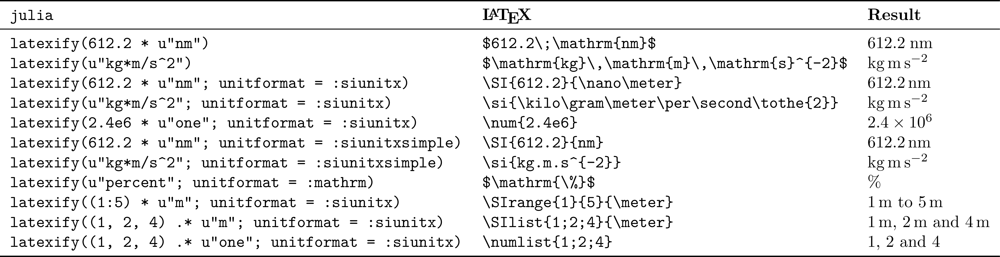
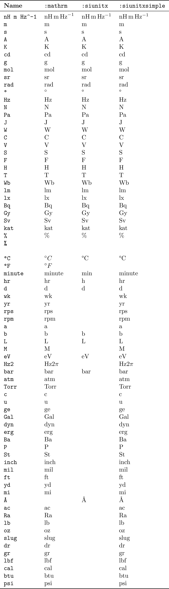

# UnitfulLatexify.jl

A glue package for [Unitful.jl](https://github.com/PainterQubits/Unitful.jl)
and [Latexify.jl](https://github.com/korsbo/Latexify.jl), allowing easy and
pretty latexification of Unitful quantities, numbers and units.

The default usage is pretty intuitive:

```@example main
using Unitful, Latexify, UnitfulLatexify

a = 9.82u"m/s^2"
t = 4u"s"
x = a*t^2

latexify(x)
```

or more usefully:

```@example main
latexify(:(x = a*t^2 = $x))
```

This of course also works for `Units` objects by themselves:

```@example main
latexify(u"kg*m")
```

Some more usage examples:




## Arrays

Because Latexify is recursive, an array of unitful quantities is shown as
expected:


```@example main
latexify([12u"m", 1u"m^2", 4u"m^3"])
```

A special case is an array where all elements have the same unit, and here
UnitfulLatexify does some extra work:
```@example main
latexify([1, 2, 3]u"cm")
```


## siunitx.sty

If you are exporting your numbers to an actual LaTeX document, you will of
course want to use the commands from `siunitx.sty` rather than the `\mathrm`
style used by default. To this end, UnitfulLatexify introduces a keyword
argument `unitformat` which is `:mathrm` per default, but can be set to
`:siunitx` for `\qty{8}{\second\meter\per\kilo\gram}` style and `:siunitxsimple` for
`\qty{8}{s.m/kg}`. Like other Latexify keywords, this can be set to be a default
by using `set_default(unitformat=:siunitx)`, or given with each latexification
command:

```@example main
latexify(612.2u"nm"; unitformat=:siunitx) # This will not render right without the `siunitx` package
print(ans) # hide
```

### One

`siunitx` can also render unitless numbers nicely by putting them in `\num` commands. As the Unitful `NoUnits` is so fragile, `UnitfulLatexify` exports a unit `u"one"` which stays with a quantity until it's combined with another unit. You'll have to invoke this manually:

```@example main
latexify(2e6u"one"; unitformat=:siunitx)
print(ans) # hide
```

### Ranges and lists

Another thing that `siunitx` does uniquely is lists and ranges of quantities.
If you want the default behaviour of tuples and ranges to be printed as arrays,
use `collect(x)` or `[x...]` to explicitly turn them into arrays first.

```@example main
string.([
latexify((1:5)u"m"),
latexify((1:5)u"m"; unitformat=:siunitx),
latexify(collect((1:5)u"m"); unitformat=:siunitx),
latexify((1u"m", 2u"m", 3u"m"); unitformat=:siunitx),
latexify((1:5)u"one"; unitformat=:siunitx),
])
```


## Plots labels

UnitfulLatexify also interfaces with
[UnitfulRecipes.jl](https://github.com/jw3126/UnitfulRecipes.jl) by way of
implementing a two-argument `(label, unit)` recipe:

```@example main
latexify("v", u"km/s")
```

This enables this dreamlike example:

```@example plot
using Unitful, Plots, Latexify, UnitfulRecipes, UnitfulLatexify
gr()
default(fontfamily="Computer Modern")

m = randn(10)u"kg"
v = randn(10)u"m/s"
plot(m, v; xguide="\\mathrm{mass}", yguide="v_x", unitformat=latexify)
```

(note that this keyword argument `unitformat` is named the same by coincidence,
but unrelated to the `unitformat` of `latexify`)

This format, ``v_x\;/\;\mathrm{m}\,\mathrm{s}^{-1}``, is subject to personal
preference. UnitfulLatexify offers a couple of other formats, and you can
simply provide any two-argument function that turns a label and a unit into a
string:

```@example plot
args = (m, v)
kwargs = (xguide="\\mathrm{mass}", yguide="v_x", legend=false)
plot(
	plot(args...; kwargs..., unitformat=latexslashunitlabel),
	plot(args...; kwargs..., unitformat=latexroundunitlabel),
	plot(args...; kwargs..., unitformat=latexsquareunitlabel),
	plot(args...; kwargs..., unitformat=latexfracunitlabel),
	plot(args...; kwargs..., unitformat=(l, u)->string("\$", l, " \\rightarrow ", latexraw(u), "\$")),
)
```

## Per-modes

In mathrm-mode, one might prefer ``\mathrm{J}\,/\,\mathrm{kg}`` or
``\frac{\mathrm{J}}{\mathrm{kg}}`` over ``\mathrm{J}\,\mathrm{kg}^{-1}``. This
can be achieved by supplying `permode=:slash` or `permode=:frac` respectively.

These will have no effect in `siunitx` mode, because the latex package handles
this for you, and you can set it in your document.

## New siunitx syntax

Starting from `v1.6`, the new syntax from `siunitx v3` (`\qty, \unit` rather
than `\SI, \si`) is used. If you cannot upgrade `siunitx`, there's the option
to use `siunitxlegacy=true`.

## A more complete list of defined units

Below is a poorly scraped list of units defined in `Unitful` and what comes out
if you run it through `latexify`. Feel free to create an issue if there's a
unit missing or being incorrectly rendered (and suggest a better ``\LaTeX``
representation if you know one).


